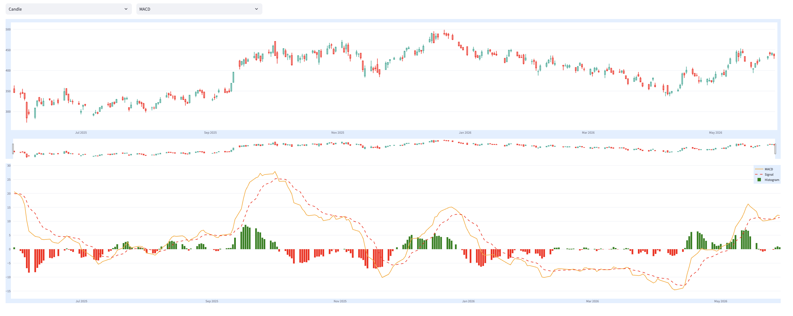
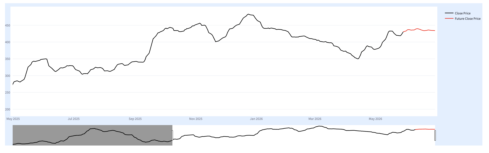

<div align="center">
  
  
  <h1>📈 Trading App: Analysis & Forecasting Dashboard</h1>
  <p><b>An interactive, real-time stock market analysis and prediction web application built with Streamlit.</b></p>


  <!-- Live Demo Badge -->
  <a href="https://trading-application-guide.streamlit.app/">
    
  </a>
  <br><br>
  <!-- Badges -->
  
  
  
  
  
</div>

---

## 🌟 Overview

The **Trading App Dashboard** is a powerful financial tool designed to help investors, traders, and data enthusiasts analyze historical stock performance and predict future price movements. 

By leveraging the `yfinance` API for real-time market data, `Plotly` for stunning interactive visualizations, and `statsmodels` (ARIMA) for time-series forecasting, this application provides a comprehensive overview of any publicly traded company.

---

## 🚀 Core Features

This application is split into two primary modules designed to give you a complete picture of the market:

### Part 1: Stock Analysis (The Present & Past)
This module allows you to dive deep into a company's historical data and current financial health.
- **Fundamental Metrics:** View critical data points like Market Cap, PE Ratio, EPS, and Debt-to-Equity ratios.
- **Interactive Technical Charting:** Explore historical price action using Candlestick or Line charts.
- **Technical Indicators:** Overlay popular indicators like **RSI** (Relative Strength Index), **MACD**, and **Simple Moving Averages (SMA)** to identify trends and momentum.
- **Custom Timeframes:** Instantly filter data from the last 5 days up to the maximum available history.

### Part 2: Stock Prediction (The Future)
This module leverages Machine Learning to forecast where the stock might go next.
- **ARIMA Modeling:** Utilizes the AutoRegressive Integrated Moving Average (ARIMA) model to predict future price movements based on historical patterns.
- **Automated Processing:** Automatically handles data scaling, stationarity checks (ADF test), and differencing to optimize the model.
- **30-Day Forecast:** Generates a visual 30-day forward-looking prediction, complete with calculated RMSE (Root Mean Square Error) scores so you can evaluate the model's accuracy.

---

## 📸 App Screenshots

### 1. Main Dashboard & Technical Analysis
> Visualizing stock performance with MACD and Candlestick overlays.


### 2. Stock Price Prediction
> 30-Day future forecast utilizing the ARIMA model.


---

## 📁 Repository Structure

```text
.
├── LICENSE                      # License information
├── README.md                    # Project documentation
├── SOURCES.txt                  # Reference and source tracking
├── Trading_App.py               # 🚀 Main application entry point
├── app.png                      # Application screenshot/icon
├── image1.png                   # Placeholder for dashboard screenshot
└── image2.png                   # Placeholder for prediction screenshot
└── pages/
    ├── Stock_Analysis.py        # Analysis UI & logic
    ├── Stock_Prediction.py      # ML forecasting UI & logic
    └── utils/
        ├── __init__.py
        ├── model_train.py       # ARIMA architecture & evaluation
        └── plotly_figure.py     # Custom Plotly rendering functions
```
---

## 🛠️ Installation & Setup

Follow these steps to get the app running on your local machine.

### 1. Clone the Repository
```bash
git clone https://github.com/your-username/Your-Repo-Name.git
cd Your-Repo-Name
```

### 2. Create a Virtual Environment (Recommended)
```bash
python -m venv venv
source venv/bin/activate  # On Windows use: venv\Scripts\activate
```

### 3. Install Dependencies
```bash
pip install streamlit pandas numpy yfinance plotly scikit-learn statsmodels pandas-ta
```

### 4. Run the Streamlit App
```bash
streamlit run Trading_App.py
```

The application will automatically open in your default web browser at `http://localhost:8501`.

---

## 🤝 Contributing

Contributions, issues, and feature requests are welcome! 

1. Fork the Project
2. Create your Feature Branch (`git checkout -b feature/AmazingFeature`)
3. Commit your Changes (`git commit -m 'Add some AmazingFeature'`)
4. Push to the Branch (`git push origin feature/AmazingFeature`)
5. Open a Pull Request

---

## 📝 License

Distributed under the MIT License. See `LICENSE` for more information.

---
<p align="center">Developed with ❤️ for Data & Finance.</p>
